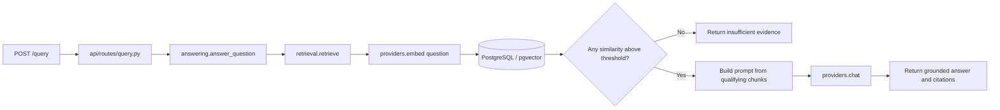
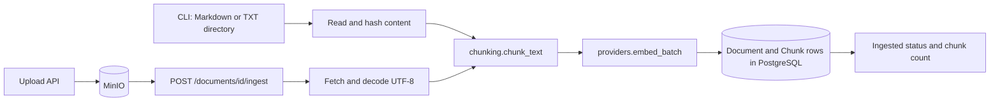

# Architecture — Enterprise RAG Knowledge Assistant

## Context

A FastAPI backend (+ an optional Next.js product UI, Phase 2) backed by PostgreSQL/pgvector for
metadata/chunks/embeddings and MinIO for raw uploaded files, answering questions grounded in a
small internal knowledge base, using a local (or optionally external) LLM through a narrow
provider boundary. External APIs may receive only the designated public sample PDFs; all other
repository and user data stays local.

## Current architecture

### Query flow

### Ingestion flow

Both entry points share the same chunk/embed/store core in `ingestion.py`.

## Major components

| Component | Responsibility |
|---|---|
| `main.py` | App bootstrap, router registration, CORS |
| `config.py` | Single configuration boundary |
| `providers.py` | `LLMProvider` — one OpenAI-compatible client for both embeddings and chat; `get_llm_provider()` FastAPI dependency |
| `storage.py` | `ObjectStorage` — MinIO/S3-compatible client for uploaded files; `get_storage()` FastAPI dependency (Phase 2) |
| `db.py` | Engine/session management, `init_db()`, `check_db_reachable()`, `get_db()` FastAPI dependency |
| `models.py` | `Document` (object_key-unique, status lifecycle), `Chunk` ORM models (pgvector `Vector(384)` column) |
| `chunking.py` | Paragraph-aware text splitter |
| `ingestion.py` | Shared chunk/embed/store core; `ingest_file`/`ingest_directory` (CLI) and `ingest_uploaded_document` (Phase 2 API) |
| `retrieval.py` | Cosine-similarity top-k retrieval + evidence-sufficiency threshold |
| `answering.py` | Builds the grounded prompt, calls the LLM, or returns "insufficient evidence" without calling it; structured request logging |
| `api/routes/query.py` | `POST /query` |
| `api/routes/documents.py` | `POST /documents/upload`, `GET /documents`, `GET/DELETE /documents/{id}`, `POST /documents/{id}/ingest` (Phase 2) |
| `api/routes/health.py` | `/live`, `/ready`, `/health` |
| `cli.py` | `init-db`, `ingest` — wired to `make migrate` / `make ingest` |
| `scripts/evaluate.py` | Evaluation harness — see `evaluation.md` |
| `scripts/check.sh` | One-command backend verification: Ruff, mypy, then the complete pytest suite |
| `frontend/` | Next.js product UI (Upload/Documents/Ask) — see `docs/adr/0011-phase2-stack.md` |

## Diagrams

The Mermaid query and ingestion diagrams above are the source of truth for current behavior.
[`docs/diagrams/`](diagrams/) contains older Excalidraw views retained as historical visual
artifacts; they may be stale and are not updated under the current roadmap. See
[`docs/diagrams/README.md`](diagrams/README.md) for that convention.

## Major decisions

See [`adr/`](adr/):

- [ADR-0001](adr/0001-initial-architecture.md) — start minimal, design for extension (from the canonical template)
- [ADR-0002](adr/0002-llm-provider-boundary.md) — LLM/embedding provider boundary
- [ADR-0003](adr/0003-ingestion-format-scope.md) — Markdown/text-only ingestion scope
- [ADR-0004](adr/0004-vector-only-retrieval-baseline.md) — vector-only retrieval, no hybrid/reranking yet
- [ADR-0005](adr/0005-evaluation-approach.md) — simple harness over RAGAS
- [ADR-0006](adr/0006-azure-container-apps.md) — Azure Container Apps as deployment target
- [ADR-0007](adr/0007-demo-persistence-cost-tradeoff.md) — demo vs. production persistence tradeoff
- [ADR-0008](adr/0008-guardrail-baseline.md) — guardrail baseline (input/retrieval/generation/output)
- [ADR-0009](adr/0009-hosting-strategy-for-personal-demo.md) — hosting strategy for a personal
  low-traffic demo (**Proposed**, not yet approved/deployed)
- [ADR-0010](adr/0010-local-first-product-development.md) — local-first product development;
  cloud deployment deferred to Phase 10
- [ADR-0011](adr/0011-phase2-stack.md) — Phase 2 stack: Next.js + MinIO

## Known constraints

- Local generation quality is bounded by the small local model (`qwen2.5:0.5b`) — see the
  disclosed failure mode in `evaluation.md`.
- No PDF/Office ingestion (ADR-0003; Phase 3).
- No multi-document synthesis — retrieval returns top-k chunks from possibly different documents,
  but the eval set only exercises single-document answers.
- Single trusted knowledge base, no access control (product.md non-goals).
- Upload size protection is best-effort (checked after the full body is read, not streamed) —
  acceptable for a local-first, non-internet-facing tool (ADR-0008).
- Document-borne prompt injection (a poisoned indexed document, as opposed to an adversarial
  question) is not yet covered by a dedicated eval case (ADR-0008's known gap).
- No cloud deployment yet — local-first by explicit decision, not oversight (ADR-0010).
- Local agent work targets an 8 GB Windows 11 machine with WSL2 limited to 3 GB. Backend checks
  run sequentially, and the frontend is not started or built locally.
- Local development and CI pin the frozen community image
  `pgsty/minio:RELEASE.2026-08-04T00-00-00Z` because upstream MinIO community container images
  are no longer publicly pullable. It preserves the current S3-compatible MinIO boundary but is
  a development/test dependency, not a production hosting recommendation.

## Potential future evolution

Everything below is roadmap, not current architecture — see also `product.md`'s non-goals and
[`docs/diagrams/roadmap.excalidraw`](diagrams/roadmap.excalidraw) for the visual version. Phased
by business question, not by version number — a phase starts when its question becomes worth
answering, not on a schedule.

### Phase 1 — Grounded RAG Backend v0.1 (done)

*Can users receive evidence-backed answers from a trusted internal knowledge base?* Markdown/text
ingestion, vector retrieval, grounded generation, citations, insufficient-evidence handling,
evaluation baseline, CI/security baseline.

### Phase 2 — Product UI + Document Upload + Open-Source Storage (done)

*Can a non-technical user upload documents, manage them, trigger ingestion, and ask questions
through a product UI?* Next.js UI, MinIO storage, document management API — this change.

### Phase 3 — Multi-format / Multi-source Knowledge

*Can the product ingest the real formats and sources where enterprise knowledge actually lives?*
PDF/DOCX/PPTX parsing, document metadata, a parser registry. Local file formats before remote
connectors (SharePoint/Confluence/Drive) — those need a real requirement to justify them.

### Phase 4 — Advanced Retrieval and Reranking

*When the corpus grows and terminology becomes ambiguous, can the system still retrieve the best
evidence?* Hybrid retrieval (vector + BM25/keyword), fusion, reranking, metadata filtering —
gated on Phase 2/3 producing a corpus large enough to show a *measured* retrieval gap first
(ADR-0004's reasoning still applies: don't optimize blind).

### Phase 5 — Guardrails, Evaluation, and Observability Hardening

*Can the team detect, debug, and prevent poor answers, hallucinations, prompt injection, latency
problems, and regression?* Extends the ADR-0008/`docs/observability.md` baseline: layered KPI
framework, retrieval/generation/abstention/operational metrics, a versioned eval dataset, a real
release gate.

### Phase 6 — Document Intelligence / Multimodal RAG

*Can the product answer questions when information is embedded in scanned documents, tables,
diagrams, or images?* OCR, layout-aware parsing, table extraction, multimodal retrieval.

### Phase 7 — Adaptive / Agentic RAG

*Do different questions require different retrieval paths, retries, tools, or verification
steps?* Query routing/rewriting, retry, self-check, tool use. LangChain/LangGraph evaluated here
only if orchestration complexity actually justifies them — not by default.

### Phase 8 — Personalized Long-Term Memory

*Does the product need to remember user-specific or task-specific information across sessions?*
Session/durable memory, retrieval, write/update policy, privacy/retention rules.

### Phase 9 — Multi-Agent / Integration Platform

*Do independent specialized capabilities need to collaborate?* MCP server exposure, A2A
readiness for another portfolio project to query this one via an explicit API contract — never
direct code/database coupling. Optional, not a maturity requirement.

### Phase 10 — Cloud Product Release

*Can the completed local product run on cloud with controlled cost, reliable deployment, and
clear teardown?* ADR-0009's VM + Docker Compose recommendation (or whatever's approved at the
time), GitHub Actions deployment, smoke test, cost guardrail, release tag. Deferred by ADR-0010
until the product is a real release candidate, not a fixed date.
